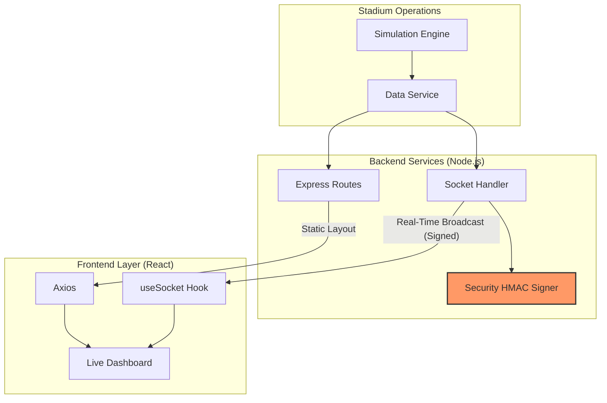

# 🏗️ VenueFlow Architecture

This document describes the high-level architecture of VenueFlow and how real-time stadium data is synthesized, secured, and synchronized.

## 📡 System Overview

VenueFlow follows a **Monolithic Backend with a Real-Time Sync Engine** pattern. The backend handles REST API requests for static venue layouts and WebSocket connections for live crowd metrics.

---

## 🔁 Real-Time Sync Engine

The heartbeat of VenueFlow is the `simulationService`. It mimics real stadium telemetry.

1.  **Generation**: Every 5 seconds, the simulation service adjusts gate densities and wait times.
2.  **Signing**: Before broadcasting, the `securityService` generates an HMAC-SHA256 signature for the current payload.
3.  **Broadcasting**: The `socketHandler` pushes the payload + signature to all connected clients.
4.  **Verification**: The client's browser verifies the signature using the `Web Crypto API` before updating any UI components.

---

## 🎨 Component Breakdown

### 🖥️ Dashboard (App.jsx)
The main controller. It manages global state for accessibility mode and orchestrates all sub-components.

### 🗺️ Live Map (Map.jsx)
Visualizes the stadium layout. Zones change color dynamically based on the `crowdData` density (Low, Med, High).

### 🏥 Security Guard (useSocket.js)
A custom hook that handles the WebSocket handshake and signature verification. If verification fails, it triggers the site-wide `security-alert-bar`.

---

## 🛠️ Performance & Scalability
- **Node.js**: Uses non-blocking I/O for high-concurrency WebSocket connections.
- **Vite**: Optimizes frontend delivery with tree-shaking and efficient code-splitting.
- **In-Memory Store**: Data is stored in-memory for O(1) retrieval speed, suitable for high-frequency stadium events.
