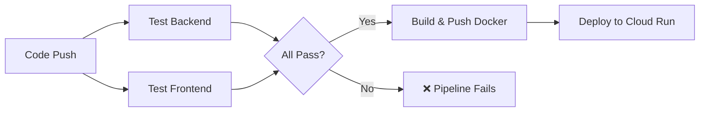

# 🔄 VenueFlow CI/CD Pipeline

This document describes the automated build, test, and deployment workflow for VenueFlow using GitHub Actions.

## 🛠️ Workflow Configuration
The pipeline is defined in [`.github/workflows/deploy.yml`](../.github/workflows/deploy.yml).

### Triggers
1.  **Continuous Deployment**: Automatically runs on every `push` to the `main` branch.
2.  **Manual Trigger**: Can be manually started from the **Actions** tab in GitHub, allowing for branch selection.

---

## 🏗️ Pipeline Stages

VenueFlow uses a **Gate-Keeped Pipeline**. Each stage must pass before the next begins.

### 1. Test Jobs (Parallel)
- **`test-backend`**: Runs Vitest on the Node.js API to ensure logic integrity.
- **`test-frontend`**: Runs ESLint and Vitest on the React dashboard to ensure code quality.

### 2. Deployment Job (Sequential)
*Depends on all Test Jobs passing.*
- **Step 1: Auth**: Authenticates with Google Cloud using a Service Account Key.
- **Step 2: Docker Build**: Compiles the unified container image (Front + Back).
- **Step 3: Push**: Uploads the image to Google Artifact Registry.
- **Step 4: Deploy**: Updates the Cloud Run service to point to the new image.

---

## 🔐 Required GitHub Secrets

To maintain the pipeline, the following secrets must be configured in the GitHub Repository under **Settings > Secrets and Variables > Actions**:

| Secret Name | Purpose | Format |
| :--- | :--- | :--- |
| `GCP_SA_KEY` | Google Service Account Key | JSON |

---

## 🚦 Monitoring Pipeline Status
- **GitHub View**: Click the `Actions` tab in your repository to see live logs for every deployment.
- **Badges**: The build status is visible at the top of the repository dashboard.

## 🧪 Manual Build & Push
If the CI/CD fails, you can manually push an image using the [Operations Guide](./OPERATIONS.md).
