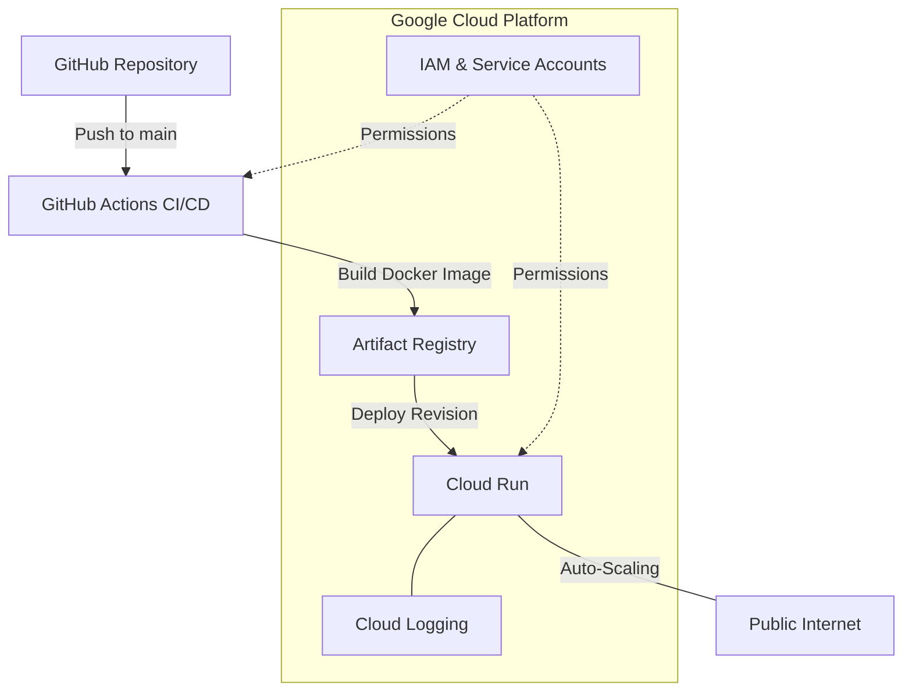

# ☁️ VenueFlow Cloud Infrastructure

This document outlines the Google Cloud Platform (GCP) architecture used to host and scale the VenueFlow platform.

## 🏛️ Infrastructure Diagram

VenueFlow uses a serverless, event-driven architecture to minimize costs and maximize scalability during major stadium events.

---

## 🛠️ GCP Resource Breakdown

### 1. Cloud Run (Compute)
- **Service Name**: `venueflow`
- **Region**: `us-central1`
- **Function**: Hosts the unified Node.js/Express backend and serves the React frontend.
- **Scaling**: Configured for `0 to 100` instances. Automatically scales to zero when no fans are using the app to save costs.

### 2. Artifact Registry (Storage)
- **Repo Name**: `venueflow-repo`
- **Format**: Docker
- **Function**: Securely stores every version of the VenueFlow container.

### 3. Identity and Access Management (IAM)
- **Service Account**: `github-deployer`
- **Roles**:
    - `roles/run.admin`: To manage Cloud Run deployments.
    - `roles/artifactregistry.writer`: To push new container images.
    - `roles/iam.serviceAccountUser`: Required for the service account to act as itself during deployment.

### 4. Networking
- **Ingress**: All (Allows public internet access).
- **Authentication**: Unauthenticated (Public dashboard access for fans).
- **SSL/TLS**: Automatically managed by Google Cloud with a managed certificate.

---

## 🔐 Configuration (Secrets)

> [!IMPORTANT]
> All sensitive cloud configurations are managed via **Cloud Run Environment Variables**.
> Ensure `SYSTEM_SECRET` is set in the GCP Console to match the security integrity protocol.

---

## 📈 Monitoring & Reliability
- **Cloud Logging**: All application errors and access logs are centralized in GCP Cloud Logging.
- **Health Checks**: Cloud Run monitors the container on port `8080`. If the process crashes, Google automatically restarts it.
