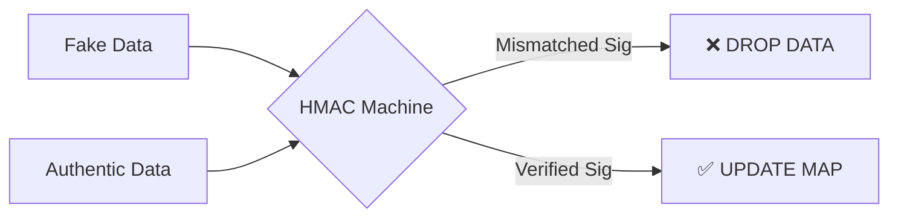

# 🔒 VenueFlow Security Protocol

VenueFlow is built with a **Defense-in-Depth** strategy to protect stadium data integrity and prevent malicious misinformation that could jeopardize fan safety.

## 🕵️ Data Integrity (HMAC-SHA256)

The core security feature is the **Cryptographic Integrity Layer**. This ensures that data seen by the fans is identical to the data generated by the stadium authority.

### How it Works:
1.  **Secret Key**: The server and client share a `SYSTEM_SECRET`. 
2.  **Signing**: The server hashes every broadcasted packet using HMAC-SHA256.
3.  **Verification**: The client verifies the signature upon receipt.

### Protection Against:
- **Man-in-the-Middle (MITM)**: Prevents an attacker on a public Wi-Fi from injecting fake crowd spikes.
- **Packet Tampering**: Ensures even a single bit change in the wait times is detected.

---

## 🚦 Network Hardening

### 1. HTTP Security (Helmet.js)
The backend uses **Helmet** to set secure HTTP headers:
- `Content-Security-Policy`: Prevents cross-site scripting (XSS) and other code injection attacks.
- `Strict-Transport-Security`: Enforces HTTPS for all connections.
- `X-Frame-Options`: Prevents Clickjacking by disallowing the site to be embedded in frames.

### 2. Rate Limiting
To prevent Denial-of-Service (DoS) attacks on the real-time feed, we enforce strict rate limits:
- **Limit**: 100 requests per 15-minute window per IP address for API endpoints.
- **Socket Throttling**: The server only listens for connection events; all client-side emits are ignored to prevent event-spamming.

---

## 🔑 Secret Management Best Practices

> [!WARNING]
> **Secret Rotation**: The `SYSTEM_SECRET` used for signatures should be unique for every stadium event. Ensure it is stored in the `.env` file and **never** committed to version control.

### Current Implementation Location:
- **Backend Signer**: `backend/src/services/securityService.js`
- **Frontend Verifier**: `frontend/src/hooks/useSocket.js`

---

## 🚫 Safe-Fail Mechanisms
If the digital signature verification fails on the dashboard:
1.  The incoming packet is **immediately discarded**.
2.  A high-priority **Security Alert Bar** is displayed to the user.
3.  The dashboard "freezes" the last known good data to prevent misinformation.
